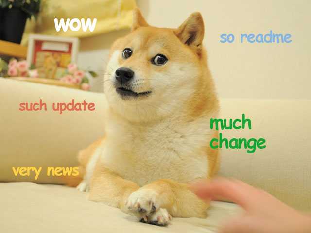

BlinkTextView
=============


&nbsp;&nbsp;&nbsp;&nbsp;&nbsp;&nbsp;&nbsp;&nbsp;



**A TextView that blinks, just like the good old HTML `<blink>` tag.**

Because, why not? Also, this is a birthday gift. Happy Birthday, Daniele! (note: it's not Daniele's birthday anymore.)


### Usage
Wait, what? Seriously?

LOL ok. Clone the repo, and reference the thing:

``` groovy
dependencies {
    compile project(':lib')
}
```

I'd suggest to copy-paste the `lib` folder to your project root and maybe rename it to something like _annoyingthingy_.
That's way more representative of what the lib does.


### Other awesome blinking stuff
With Version 2.0 of this awesome thing you can even **blink MOAR stuff**! How, you ask?

 1. Use a `<blink>` element as root in your layout XML. It _has_ to be the layout root or it won't work!

    ``` xml
    <blink
        xmlns:android="http://schemas.android.com/apk/res/android"
        android:layout_width="wrap_content"
        android:layout_height="wrap_content">
    
        <!-- Put your soon-to-be-blinking stuff in here -->
    </blink>
    ```

 2. Treat it exactly as if it were a `FrameLayout` (it actually is)
 3. ???
 4. Profit!

The lovely `BlinkLayout` is here to serve! Your layout will blink at lovely 500 ms intervals. I know it's not the best
blinking interval ever, and it's actually not even the
[same frequency](https://github.com/frakbot/BlinkTextView/blob/master/lib/src/main/java/net/frakbot/blinktextview/BlinkTextView.java#L74)\*
 that `BlinkTextView` blinks at. (\*to all the grammar nazis out there: frequency is the reciprocal of the period, we
 know. We ran out of synonims, and it's pretty clear what we're talking about anyway)

Our amazing tech allows you to use the `BlinkLayout` even without having to have the `BlinkTextView` library as a
dependency. Yeah, you read that right! This works out of the box on all Android devices and **without the need for any
additional dependency**!

Unfortunately there are some technical limitations. OCD Mode is sadly not available on `BlinkLayout`. But we think that
having _the whole layout blinking is annoying enough anyway, so it shouldn't be a big issue.

By the way, yes, the `BlinkLayout` is an easter egg (we guess) in the
[AOSP code](https://github.com/android/platform_frameworks_base/blob/master/core/java/android/view/LayoutInflater.java#L467)...


### What's super cool* about it
We have a magnificent **OCD mode**. It will randomly change the blink period so that it's even more effective. Make
each of your blinks completely unique, your users will want to "thank" you! Guaranteed.

Also, **you can't change the default blinking period**. There's sound science behind it. Also, writing getters and
setters is boooring. Yes, it's boring even when the IDE can generate them automatically for you.

Oh, about that *, read: _annoying_.


### Demo

There is no demo. No, seriously. Build it yourself. Hell, it's a blinking thing!


### License
This library is...

No, can't keep a straight face saying it, sorry. Let me try again.

This _library_ is released under a very liberal [Apache License 2.0](http://www.apache.org/licenses/LICENSE-2.0.html).
Basically, do whatever you want with it, but don't blame us if your users/clients/loved ones/imaginary friends will
want to kill you for using it. Also, be nice and put our name somewhere (so that you can blame us for it!).

Usually people buries the OSS credits somewhere in their settings screen, at the bottom, under a sub item, and then you
have to walk 120 steps to the East, turn around three times while saying "Cicciput!", jump, grab a portal gun, open a
portal under your feet and another on that remote wall up there, touch your nose and the credits will appear behind you.

That's fine with us. But I digress.


### Credits
This library uses the super cool [**Google Annotations Gallery**](https://code.google.com/p/gag/), which is licensed
under the [Apache License 2.0](http://www.apache.org/licenses/LICENSE-2.0.html).

Also, thanks to the always great Cyril Mottier for reminding us the existence of the `BlinkLayout`.
